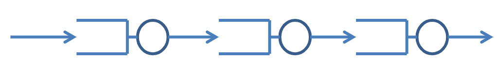

# Lab 1

## Task 1

### a) How many customers will arrive to this system per time unit?
2/2.5

### b) Run the simulation program some times times.
### What is, approximately, the mean number of customers in the system?
1.8

### c) Change the time between arrivals and complete the table below. Let the time between
### arrivals be a uniform distribution between 0 and 2*E(arrival time).
| E(arrival time) | Mean number of customers |
|-----------------|--------------------------|
|        2        |          0.65            |
|       1.5       |          1.05            |
|       1.2       |          2.15            |
|       1.1       |          3.90            |
|      1.01       |           34             |

### d) Simulate the system ten times each for the two different times between arrivals seen in the
### table. What can you say about the accuracy of the results
| Simulation no. | E(arrival time) = 1.3 | E(arrival time) = 1.001 |
|----------------|-----------------------|-------------------------|
|        1       |   1.6307385229540918  |    55.55621890547264    |
|        2       |   1.522488038277512   |    92.472306143001      |
|        3       |   1.5784215784215785  |    14.613034623217922   |
|        4       |   1.5863821138211383  |    10.09375             |
|        5       |   1.684158415841584   |    18.181451612903224   |
|        6       |   1.5389344262295082  |    20.140401146131804   |
|        7       |   1.4801980198019802  |    51.34917555771096    |
|        8       |   1.5729890764647467  |    22.213065326633167   |
|        9       |   1.5203574975173784  |    12.983589743589743   |
|        10      |   1.4538232373386295  |    20.494791666666668   |

When the rate of arrivals goes to the rate of serving customers the system becomes unstable and
there are many times when the customers pile up which raises the mean amount of customers.


### e) Simulate the system E(arrival time) = 0.8 for the three simulation times below. Explain the
### results.
| Simulation time | Mean number of customers |
|-----------------|--------------------------|
|      5000       |     579.8430173292559    |
|      10000      |     1285.0162882527147   |
|      20000      |     2432.171762366393    |

Since the rate of arrivals is faster than the rate of serving the queue is probably always full
of customers. The mean will therefore differ linearly depending on the rate of arrivals since the
rate of serving is constant.

## Task 2

### a) The class QS defines a process type that models a queuing system. How many servers does
### the queuing system have?
It has 1 server.
```
numberInQueue++;
if (numberInQueue == 1){
  SignalList.SendSignal(READY,this, time + 0.2*slump.nextDouble());
}
```

### b) How many customers can a server serve per time unit?
10

### c) How many customers will arrive to the queuing system per time unit?
9

### d) Change the program so that the following system is simulated:


### What is the mean number of customers in each one of the systems?
Mean number of customers in queuing system Q1: 3.4591337513478972
Mean number of customers in queuing system Q2: 3.4032404769758213
Mean number of customers in queuing system Q3: 3.3736692157744788


### e) Change the simulation program so that the queuing systems have two servers. Now a server is slower and it takes in the mean twice as long time to serve a customer. What is now the mean number of customers in each queue if you simulate the system in d) above?
Without one slower server:

Mean number of customers in queuing system Q1: 3.538580169642589
Mean number of customers in queuing system Q2: 3.39603
Mean number of customers in queuing system Q3: 3.2566225497066656

With an additional slower server in each queueing system:

**Todo**
